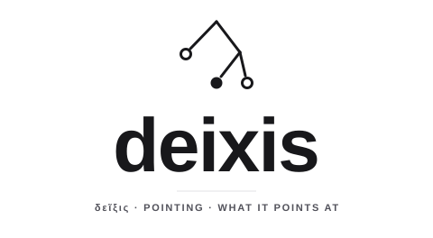

<!-- design:figure id=deixis-wordmark -->
<p align="center">
  <picture>
    <source media="(prefers-color-scheme: dark)" srcset="./docs/img/deixis-wordmark-dark.svg">
    
  </picture>
</p>
<!-- /design:figure -->

<p align="center"><em>δεῖξις — pointing, showing.</em></p>

---

**deixis is the structure of a tree, and nothing about what a tree holds.**

```
Node(.) = (.) × (Key ⇀ Node(.))
Key     = Bytes
```

`(.)` is the slot: opaque to deixis, supplied by context. Every node has a mandatory own
value and a finite map of named children, keyed by byte strings. Identity uses an
equivalence the caller supplies; construction and navigation need no comparison at all.
Optional values are an explicit instantiation, `Node[Option[T]]`, and pure shape is
`Node[Unit]`.

deixis is a floor: it fixes how a tree is built, navigated, compared, taken apart and put
back together, and how it is written down as bytes. It says nothing about what a value
means. A system that carries its content as trees, such as descriptors, records, signed
facts or bindings, can share one structure and one encoding without sharing a vocabulary.

## What deixis is not

deixis is **not a data model**: it has no types, no schema and no validation, because the
slot is opaque and what a value means belongs to whoever supplies it. It is **not a store**:
it keeps nothing, answers no queries and records no history; a system keeps the bytes deixis
writes. It is **not a transport**: it fixes how a tree is written as bytes and how it is
addressed, not how those bytes travel or who may read them. And it **does not sign or
trust**: an address says which bytes a tree is, never who made them or whether to believe
them.

## Status

- **The model is implemented** in four languages: Rust, Go, TypeScript and Python. All four
  are judged by one black-box harness against one hand-authored corpus, on every change.
- **The canonical codec, `deixis-codec-v2`, is a candidate and is not frozen.** All four
  cores encode and decode it in its flat and linked forms. Until its freeze manifest is
  signed, a release may still change bytes and addresses, and says so in its notes, so do
  not store or sign its output expecting it to survive. [Issue #1](https://github.com/Bitspark/deixis/issues/1)
  tracks what the freeze still needs.
- **Pre-1.0.** The API can change between minor releases; each release's notes say how.

## Install

```sh
# Go: module github.com/bitspark/deixis, go 1.24
go get github.com/bitspark/deixis@v0.6.0
```
```go
import deixis "github.com/bitspark/deixis/core/go"
```

```sh
# TypeScript: ESM; the codec is at the /codec subpath
npm install @bitspark/deixis-core
```

```sh
# Rust: the crates take a vendor prefix on crates.io; the library names do not
cargo add bitspark-deixis-core     # then: use deixis_core::...
```

Python is a validation peer and is not published: put `core/py` of a release tag on your
path. The structure profiles live beside the core: positional keys in `pos/`, published as
`@bitspark/deixis-pos` and `bitspark-deixis-pos`, and finite sets in `set/`, which is
source-only. [API.md](docs/API.md) describes the interfaces and the payload choices in
each language.

## The specification

- [TREE.md](docs/TREE.md): the definition, and identity.
- [PATH.md](docs/PATH.md): paths, resolution, and why they do not flatten.
- [SLOTS.md](docs/SLOTS.md): what can go in the slot, and what each choice buys.
- [CODEC.md](docs/CODEC.md): `deixis-codec-v2`, the canonical bytes and addresses of the
  current model, a candidate contract, with its [proofs](docs/CODEC-proofs.md). The
  withdrawn v1 candidate is kept in [CODEC-v1.md](docs/CODEC-v1.md).
- [WIRES.md](docs/WIRES.md): the interaction side, what conveys without being understood.
- [docs/design/](docs/design/): the decisions, numbered, with their reasons.
- [The paper](docs/paper/deixis.pdf): the formal foundation and its proofs.
- [EVIDENCE.md](docs/EVIDENCE.md): what stands under each claim, whether proved,
  enforced, observed or only stated.

## Conformance

No implementation is the reference. The specification and the corpus in
[vectors/](vectors/) jointly define conformance, and the harness recomputes every case
against each core rather than trusting a recorded answer:

```sh
node tools/conformance/harness.mjs
```

[tools/conformance/](tools/conformance/) also holds `interop.mjs`, which checks the four
cores against each other on generated values and on mutations of their octets (agreement,
which is not conformance), and `mutants.mjs`, which measures the corpus by planting
defects in a core and reporting each one no case notices. A conformance claim is scoped:
software implementing part of the codec names the profiles it implements
([CODEC.md](docs/CODEC.md) §16).

## History

deixis was developed in a private repository through v0.5.0, and this repository starts
from a fresh history at that point. The release notes in [docs/releases/](docs/releases/)
describe the earlier releases, v0.2.0 to v0.5.0, which were published privately. The
documents still cite commits, and the release notes cite pull requests as
`deixis-internal#N`, from that history; those references are provenance, and they are
not reachable from here. The first public release is v0.6.0.

## License

Apache License 2.0; see [LICENSE](LICENSE). Contributions are welcome under the same
license: read [CONTRIBUTING.md](CONTRIBUTING.md) first, and report vulnerabilities as
[SECURITY.md](SECURITY.md) describes.

<p align="center"><sub><em>A node is what it points at.</em></sub></p>
